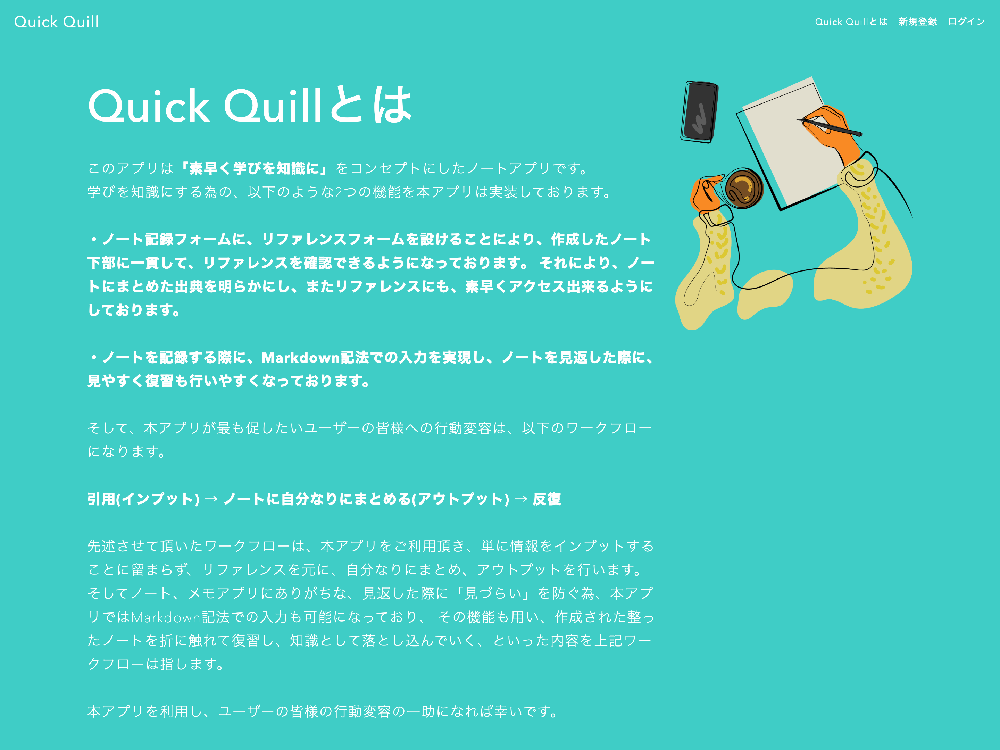

# Quick Quill

## サービス概要 :
このアプリは「**素早く学びを知識に**」をコンセプトにしたノートアプリです。

## ビュー :

## サイトURL :
[Quick Quill](https://quick-quill.herokuapp.com/)

## ユーザーが抱える課題 :
- 見返した時に、見やすいノートを制作したい。
- リファレンスをしっかり残して、ノートを取りたい。

## アプリの機能 :
- Markdown記法を用いて、見出し機能などのマークアップで簡単にノートを作成することが出来ます。
- ノートにまとめる際に、簡単にリファレンスも一緒に記録に残すことが出来ます。

## 使用技術 :
### フロントエンド
- HTML
- CSS
### バックエンド
- Ruby 3.1.4
- Rails 7.0.4.3
### インフラ
- Heroku
- PostgreSQL
### CI/CD
- GitHub Actions